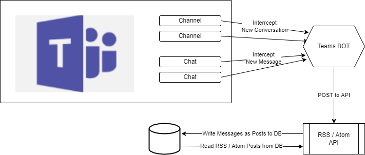

# Teams RSS Feed

## Purpose

To attach to a Teams Channel or Chat, and post messages to an API so that they can be surfaced
as an RSS Feed.

## System Design

## Process

- Teams BOT published
- User installs Teams BOT to a Channel / Chat, with a Unique Id
- BOT intercepts New Channel Converstaions or Chat messages, depending on what attached to
- BOT posts messages to RSS Feed API
- Unique Url exposed for each Channel / Chat
- User can subscribe to Feed as they usually would as its a standard RSS/Atom Feed

